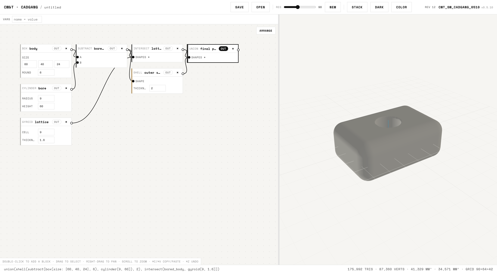
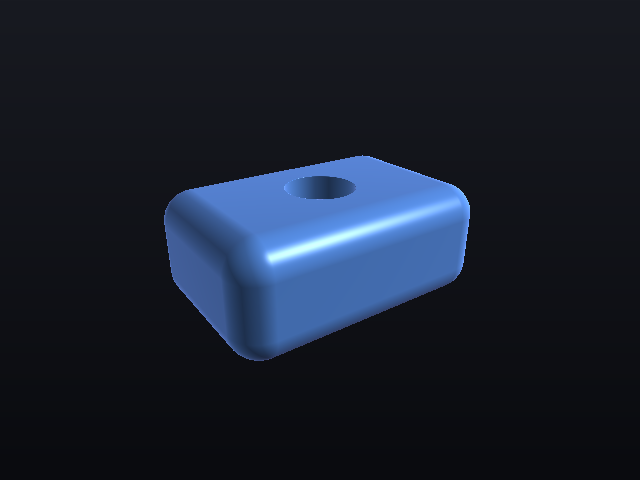
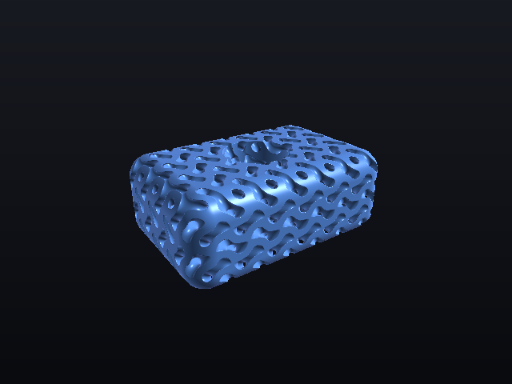

# cadgang

Block-based CAD that runs in your browser — with a REST API, live WebSocket updates, and a built-in **MCP server** so Claude Code can drive it end-to-end: build models, inspect geometry, render previews, and export STL **and STEP**.

cadgang carries **two geometry representations in one node graph**: exact **B-rep** solids (OpenCascade — real fillets, real STEP out) and implicit **distance fields** (lattices, TPMS infill, smooth blends, drape). They meet at a deliberately [one-way bridge](#the-two-lineages).



A modeling session — building a gyroid-latticed spikeball from scratch in the node editor ([mp4 in the repo](docs/demo.mp4)):

https://github.com/user-attachments/assets/6960d62b-7610-4623-9ec3-8bda3a237a73

cadgang sits in the lineage of functional-representation CAD: [kokopelli](https://github.com/mkeeter/kokopelli), Matt Keeter's Python-scripted f-rep CAD/CAM tool (and its successors [Antimony](https://github.com/mkeeter/antimony) and [libfive](https://libfive.com)), and the implicit-modeling approach [nTopology](https://www.ntop.com/) built a company on. Where kokopelli describes models as code and nTop as a graph of implicit operations, cadgang does both: models are **graphs of blocks** evaluated as signed distance fields (SDFs), and every graph compiles down to a one-line functional formula (shown live in the footer). Because geometry is a function, not a boundary mesh, booleans never fail, shells and offsets are exact, and TPMS lattices are a single block.

| Raymarched preview | Gyroid lattice infill |
|---|---|
|  |  |

## Install

Requires [Node.js](https://nodejs.org) ≥ 18 and a modern browser. No build step — the web app is plain ES modules.

```bash
git clone https://github.com/cheewee2000/cadgang.git
cd cadgang
npm install
npm start          # → http://localhost:4477
```

Then:

```bash
npm run demo       # builds a gyroid-filled demo part via the REST API
npm test           # 80 kernel/API unit tests
```

Open http://localhost:4477 — the viewport live-updates (WebSocket) whenever the model changes, whether from the UI, the REST API, or Claude via MCP. The model autosaves to `data/document.json`, so state survives restarts and the UI and MCP always share one model. `CADGANG_PORT` and `CADGANG_DOC` select an alternate port/document for scratch instances.

## The editor

- **Double-click** the graph to add a block, **drag** between ports to wire, **drag** blocks to move, right-drag to pan, scroll to zoom, marquee-drag to multi-select, **⌘C/⌘V** copy/paste, **⌘Z** undo, **Arrange** for a tidy dependency layout
- **VARS bar** — define named variables (`w = 60`); any numeric param accepts an expression (`w/2 + 3`) that re-evaluates when the variable changes
- **STACK / SIDE** toggles the graph/viewport split between stacked and side-by-side; **DARK** toggles the theme; **COLOR** switches per-part color vs. stainless render
- **Save / Open** stores named models server-side (`saves/`)
- Click the footer formula to see the whole model as a nested functional expression
- **Settings** opens a tabbed settings window: **Display** (theme, model colour, layout, preview resolution — the same switches as the header buttons) and **3D mouse** for a 3Dconnexion SpaceMouse — see [3D mouse](#3d-mouse-spacemouse). Every setting applies as soon as you change it.

### 3D mouse (SpaceMouse)

Any 3Dconnexion puck (SpaceNavigator, SpaceMouse Compact / Wireless / Pro / Enterprise, wired or via the universal receiver) drives the viewport in **object mode**: the model is in your hand.

| Cap | Viewport |
|---|---|
| push left / right, lift / press | pan |
| push away / pull back | zoom in / out |
| tilt forward / back | tumble (pitch) |
| twist | spin (yaw) |
| left button | home view |
| right button | fit model |

Roll (tilting the cap sideways) is ignored — the camera is a Z-up turntable and has no roll.

**Setup.** Open **Settings → 3D mouse**, click **Connect** and pick the device in the browser's prompt. The browser remembers the grant, so from then on the puck is live as soon as the page loads. The panel shows the six axes moving in real time, plus speed sliders, a dead-zone slider and per-axis invert toggles (device firmware and hands disagree about which way is "forward"; flip an axis rather than fight it). Settings persist in the browser.

**Two routes to the device.** Settings → 3D mouse → *Route* picks one; *Auto* tries the driver first.

1. **3Dconnexion driver (3DxWare).** If the vendor driver is installed, cadgang talks to its local Navigation Library server (`3DxNLServer`, a WAMP WebSocket on the loopback alias `127.51.68.120`). The driver reads the scene from cadgang — camera, field of view, model extents, hit-tests — and writes the camera back while the cap is deflected, so speed, axis directions, Fit and the view buttons all come from 3Dconnexion's own settings. cadgang also publishes its view commands (fit, home, front, top, right, isometric) to the driver, so the puck's buttons can be mapped to them in 3Dconnexion Settings → Buttons; the generic profile puts the first two on the MENU and FIT buttons. This is the only route that works while 3DxWare is running, because the driver opens the puck *exclusively* (IOKit reports `kIOReturnExclusiveAccess`). It works on macOS and Windows and in **any browser that trusts the driver's certificate**, which the 3DxWare installer adds to the system keychain — Safari and Firefox included.
2. **Device directly (WebHID).** With no driver installed, the puck is read straight over [WebHID](https://developer.mozilla.org/en-US/docs/Web/API/WebHID_API) — no vendor software at all, same on macOS, Windows and Linux. WebHID exists only in Chrome, Edge, Opera and other Chromium browsers, on a secure origin (`localhost` or `https`). Speed, dead zone and per-axis invert are cadgang's own settings on this route.

**Safari and Firefox without the driver cannot use a SpaceMouse.** They have no WebHID, and their Gamepad API only enumerates HID joysticks and gamepads — a 3Dconnexion puck is a *multi-axis controller*, so those browsers never see it at all (Chromium's Gamepad API does, which is why cadgang keeps a Gamepad fallback for Chromium builds with WebHID switched off). Opening the 3D mouse settings tab in that situation shows a dismissable notice; there is no way to detect the device itself there.

Platform notes:

- **macOS** — with 3DxWare installed, use the driver route (the default). To use WebHID instead, quit **3DconnexionHelper** from the 3Dconnexion menu-bar icon or Activity Monitor first, or uninstall 3DxWare; otherwise Chrome's **Connect** fails with "Failed to open the device".
- **Windows** — either route works; the driver route is preferred when 3DxWare is present.
- **Linux** — WebHID only (there is no 3DxWare). The browser needs read access to the `hidraw` node. Add a udev rule and re-plug the device:
  ```
  # /etc/udev/rules.d/70-spacemouse.rules
  KERNEL=="hidraw*", ATTRS{idVendor}=="256f", MODE="0666", TAG+="uaccess"
  KERNEL=="hidraw*", ATTRS{idVendor}=="046d", ATTRS{idProduct}=="c62*", MODE="0666", TAG+="uaccess"
  ```
  Stop `spacenavd` if it is running; it also opens the device.

[`web/navlib.js`](web/navlib.js) is the driver route: a ~150-line WAMP v1 client written from the community-documented protocol (no vendor code), exposing cadgang's scene as the properties the driver reads and writes. [`web/spacemouse.js`](web/spacemouse.js) is the direct route: it parses the 3Dconnexion HID reports (translation, rotation, buttons) into a normalized six-axis state that `app.js` integrates into the orbit camera every frame. Neither knows anything about Three.js.

## Claude Code integration (MCP)

The repo ships a `.mcp.json`, so opening it in Claude Code auto-registers the `cadgang` MCP server. To register manually:

```bash
claude mcp add cadgang -- node /path/to/cadgang/src/mcp/index.js
```

The cadgang web server must be running (`npm start`). Set `CADGANG_URL` if it's not on `http://localhost:4477`.

### MCP tools

| Tool | What it does |
|---|---|
| `cadgang_list_node_types` | Discover every block type, its params and input slots |
| `cadgang_get_document` | Read the full model graph |
| `cadgang_create_node` / `cadgang_update_node` / `cadgang_delete_node` | Edit the graph |
| `cadgang_set_output` | Choose which block is meshed/exported |
| `cadgang_clear_document` | Wipe the model (destructive) |
| `cadgang_undo` | Undo (or redo) the last model edit |
| `cadgang_import_step` | Import a STEP/IGES/BREP file from disk as an `imported_mesh` block |
| `cadgang_export_step` | Write an exact STEP B-rep file (refuses field geometry) |
| `cadgang_eval_sdf` | Sample signed distances at points (thickness/clearance checks) |
| `cadgang_mesh_stats` | Triangle count, volume, surface area, bounds, and whether the result is exact |
| `cadgang_export_stl` | Write a binary STL to `exports/` |
| `cadgang_render_preview` | Server-side raymarched PNG — Claude can *see* the model |

Ask Claude Code things like: *"Build a 60×40×24 mm rounded enclosure with a 2 mm wall, fill it with a 9 mm gyroid lattice, show me a preview, and export it for printing."*

## The two lineages

A block belongs to one of two representations, and the block's colour tells you which — blueprint blue for exact, machined metal for fields.

| | **B-rep (exact)** | **Fields (implicit)** |
|---|---|---|
| Geometry is | trimmed analytic surfaces + topology | a function `d(x,y,z)` |
| Meshed by | OpenCascade tessellation | surface nets over a grid |
| Exports to | **STEP** (and STL) | STL |
| Good at | precise dimensions, real fillets, machining handoff | lattices, TPMS infill, smooth blends, drape |
| Can't do | lattices, field blends | exact fillets, exact circles, STEP |

**A B-rep solid can feed any field block.** cadgang derives the distance field from the exact solid automatically, so you can fillet a part exactly and *then* fill it with a gyroid.

**A field can never go back.** Recovering exact trimmed surfaces from a distance field is a fitting problem, not a conversion, and it fails outright on the blends and lattices fields are best at. So the moment a field block touches a shape, that branch loses its B-rep and becomes STL-only — and `export_step` refuses it with an explanation rather than writing a faceted mesh into a `.step` file that no CAD kernel will fillet.

Practically: **keep the whole chain in B-rep blocks for anything that has to ship as STEP**, and branch into fields at the end.

## Block types

### Exact (B-rep) blocks

- **Sketches** — `sketch_rect` (with corner rounding), `sketch_circle`, `sketch_polygon`, `sketch_profile` (authored point list; a third number on a point rounds that corner). Each sits on a plane (`XY`/`XZ`/`YZ`/…) at an `offset`. A sketch is a 2D profile, not a solid — extrude or revolve it.
- **Solids** — `brep_box`, `brep_cylinder`, `brep_sphere`, `brep_extrude` (with `symmetric` to centre on the sketch plane), `brep_revolve`
- **Operations** — `brep_boolean` (union / subtract / intersect, computing the real intersection curves), `brep_fillet` (true rolling-ball fillet), `brep_chamfer`, `brep_shell`, `brep_transform`
- **Output** — `export_step` (pass-through sink with a download button)

Edge selection on `brep_fillet`/`brep_chamfer` is `all` or the edges running along `x`/`y`/`z`. Viewport edge picking is not wired up yet — see [Limitations](#limitations).

### Field (implicit) blocks

- **Primitives** — `sphere`, `box` (with rounding), `cylinder`, `torus`, `capsule`, `plane`, `gyroid`, `schwarz_p` (TPMS lattices), `polyhedron`, `spiky_sphere`, `imported_mesh` (STEP/IGES import), `extrude_face` (extrude a selected surface of an import)
- **Booleans** — `union`, `intersect`, `subtract`, `smooth_union`, `smooth_intersect`, `smooth_subtract` (blended fillets)
- **Modifiers** — `shell` (hollow to wall thickness), `offset`, `transform` (translate / rotate / scale), `drape` (vacuum-form a sheet over shapes, with smoothness control), `linear_array`, `polar_array`
- **Output** — `export_stl` (pass-through sink with a download button; params: filename, resolution). Fed by an exact solid, it tessellates the real surfaces instead of remeshing the field — smaller and more faithful.

Units are millimeters, world is Z-up. `plane`/`gyroid`/`schwarz_p` are unbounded fields — intersect them with a bounded body (that is how lattice infills are made).

### Limitations

Honest about what this is not, yet:

- **No interactive sketcher.** Profiles are authored as numbers (`sketch_profile`'s point list), not drawn on a plane with dimensional constraints. A real sketcher needs a constraint solver — FreeCAD's `planegcs` compiled to WASM is the usual answer — and would write into this same `points` param.
- **No viewport edge/face picking for fillets.** `brep_fillet` selects by direction, not by clicking an edge. The tessellation already ships per-face B-rep ids, so the data is there; the UI is not.
- **`brep_revolve` is full-turn only.** Partial sweeps need a wedge cut that isn't built yet.
- **STEP import is still tessellated** (see below), so an imported file enters the *field* lineage and cannot be filleted or re-exported as STEP. Exact B-rep import is the obvious next step — OpenCascade's `importSTEP` is already linked in.
- **The OCCT heap creeps.** Compiling B-rep blocks grows OpenCascade's WASM heap by roughly 100 MB per 800 mesh requests and it never shrinks. cadgang forces a GC after each burst of B-rep work, which reclaims what replicad's JS wrappers hold (16 → 40 MB becomes 16 → 19 MB over 300 boolean compiles), but the remainder is inside OCCT's own allocator — collecting after *every* operation does not change it. `GET /api/health` reports `brep.heapBytes` so you can watch it; restarting the server clears it. Running the kernel in a recycled worker thread is the real fix.
- **Fillets fail on tangent seams.** Filleting the vertical edges of an already-rounded profile asks OCCT to fillet a tangent seam and it refuses. The error says so in OCCT's own words.

### STEP import

Upload a `.step`/`.stp` (or IGES/BREP) file — **Import STEP** in the web UI, `POST /api/import/step`, or the `cadgang_import_step` MCP tool. The file is tessellated (WASM OpenCascade via `occt-import-js`), welded, stored as a document **asset**, and exposed as an `imported_mesh` block with an exact BVH signed-distance field. Each B-rep face of the import stays addressable as a triangle range, so surfaces are selectable in the viewport — click one to spawn an `extrude_face` block.

### Drape

`drape` drops a virtual sheet straight down (−Z) over its input shapes, like vacuum forming: it raycasts a top-surface heightfield at compile time, smooths it with a rolling-ball (parabolic) dilation of radius `blend`, and shells the result to `thickness`. `blend` controls how tightly the sheet wraps — 0 hugs every crease, larger values bridge gaps and round shoulders. `floor` sets where the skirt ends, `margin` how far the sheet overhangs.

## REST API

| Endpoint | Description |
|---|---|
| `GET /api/node-types` | Block type catalog |
| `GET /api/document` | Model graph + revision |
| `POST /api/nodes` · `PATCH /api/nodes/:id` · `DELETE /api/nodes/:id` | Graph editing |
| `POST /api/document/output` | Set output block |
| `POST /api/vars` · `DELETE /api/vars/:name` | User variables (usable in param expressions) |
| `POST /api/eval` | Evaluate SDF at points |
| `POST /api/undo` · `POST /api/redo` | Step the edit history (last 100 steps) |
| `GET /api/files` · `POST /api/files/save` · `POST /api/files/load` · `DELETE /api/files/:name` | Named model save/open |
| `POST /api/import/step?name=file.step` | Import STEP/IGES/BREP (raw body) → asset + `imported_mesh` node (`&node=id` attaches to an existing block instead) |
| `GET /api/assets` · `GET /api/assets/:id` · `DELETE /api/assets/:id` | Imported mesh assets (`:id` returns full triangles + per-face ranges) |
| `GET /api/mesh?resolution=90` | Surface-nets mesh (JSON) |
| `GET /api/mesh/stats` | Stats only |
| `GET /api/export/stl?resolution=128&file=name` | Binary STL (exact tessellation when the chain is B-rep) |
| `GET /api/export/step?file=name` | STEP B-rep file; 400s with an explanation if the chain crossed into a field |
| `GET /api/preview.png?yaw=-35&pitch=25&node=id` | Raymarched preview (any block, not just the output) |

`ws://…/ws` broadcasts `{type: "document_changed", revision}` on every edit.

## Architecture

```
src/core/     geometry kernel — pure JS, no server dependency
  sdf.js        merged block registry, graph compiler ({fn, bbox, brep}), bbox propagation
  brep.js       exact B-rep kernel: OCCT/replicad lifecycle, ops, tessellation,
                STEP I/O, shape-memory scopes, and the one-way bridge to SDF
  brepnodes.js  exact block definitions (sketches, solids, booleans, fillets)
  errors.js     GraphError, split out so brep.js and sdf.js can share it
  expr.js       safe expression evaluator for variable-driven params
  mesher.js     naive surface-nets mesher (watertight, SDF-gradient normals)
  mesh.js       mesh utilities: welding, BVH signed distance, per-face ranges
  step.js       STEP/IGES/BREP tessellation (WASM OpenCascade)
  stl.js        binary STL writer
  render.js     CPU sphere-tracer + dependency-free PNG encoder
  document.js   persistent model document, undo history, autosave
src/server/   Express REST API + WebSocket + static hosting
src/mcp/      cadgang-mcp-server (stdio, @modelcontextprotocol/sdk)
web/          Three.js viewport + node-graph editor (no build step, no framework)
```

## Prior art & credits

- [kokopelli](https://github.com/mkeeter/kokopelli) → [Antimony](https://github.com/mkeeter/antimony) → [libfive](https://libfive.com) — Matt Keeter's f-rep CAD tools, the reason this way of thinking about geometry exists in open source
- [nTopology](https://www.ntop.com/) — implicit modeling at industrial scale; the gyroid-infill demo is their party trick
- [three.js](https://threejs.org) (MIT, vendored in `web/vendor/`) · [occt-import-js](https://github.com/kovacsv/occt-import-js) (OpenCascade WASM) · [replicad](https://replicad.xyz) + [opencascade.js](https://github.com/donalffons/opencascade.js) (the B-rep kernel, MIT/LGPL) · [Space Mono](https://fonts.google.com/specimen/Space+Mono) (SIL OFL 1.1, license in `web/fonts/OFL.txt`)

Built by [CW&T](https://cwandt.com) with Claude Code.
